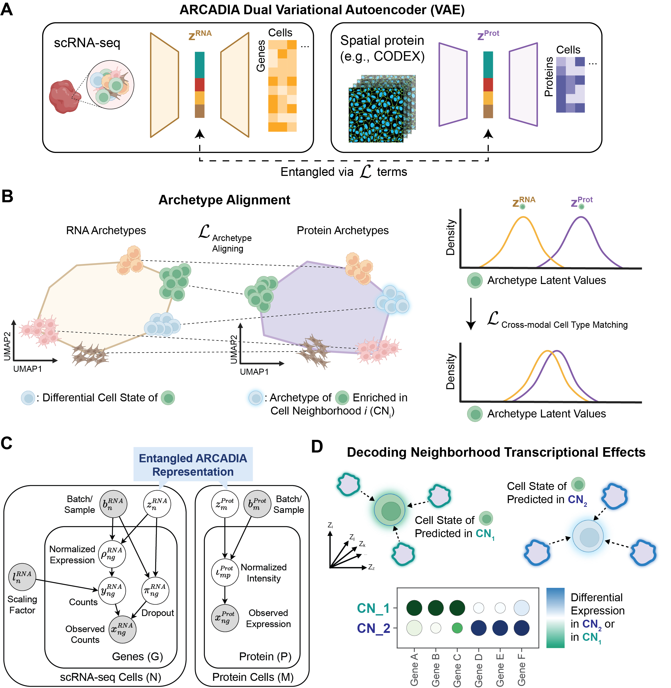
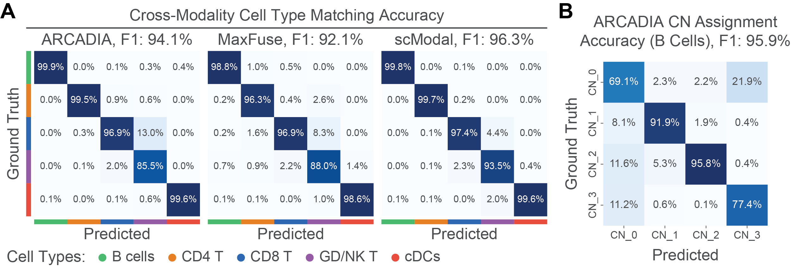
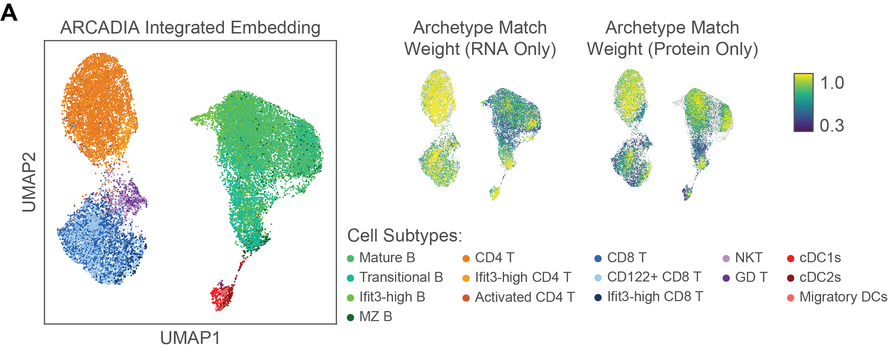
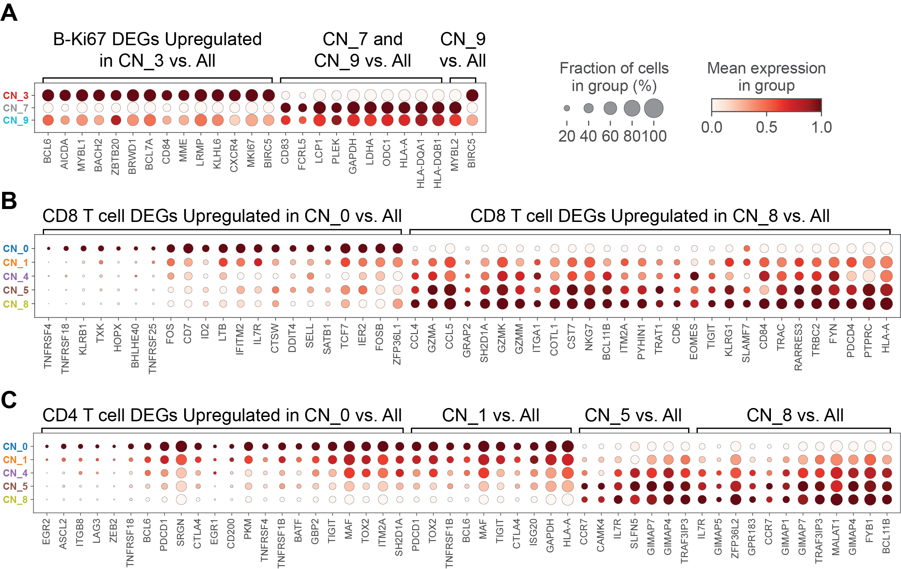
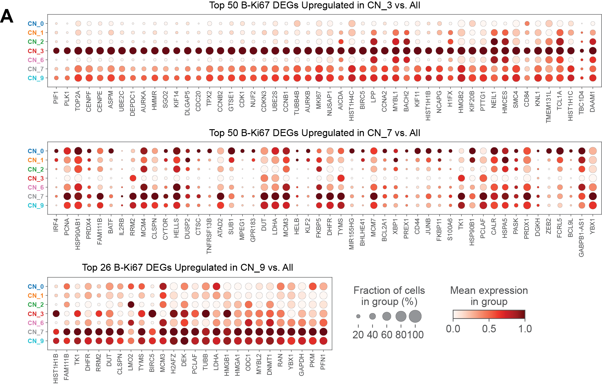
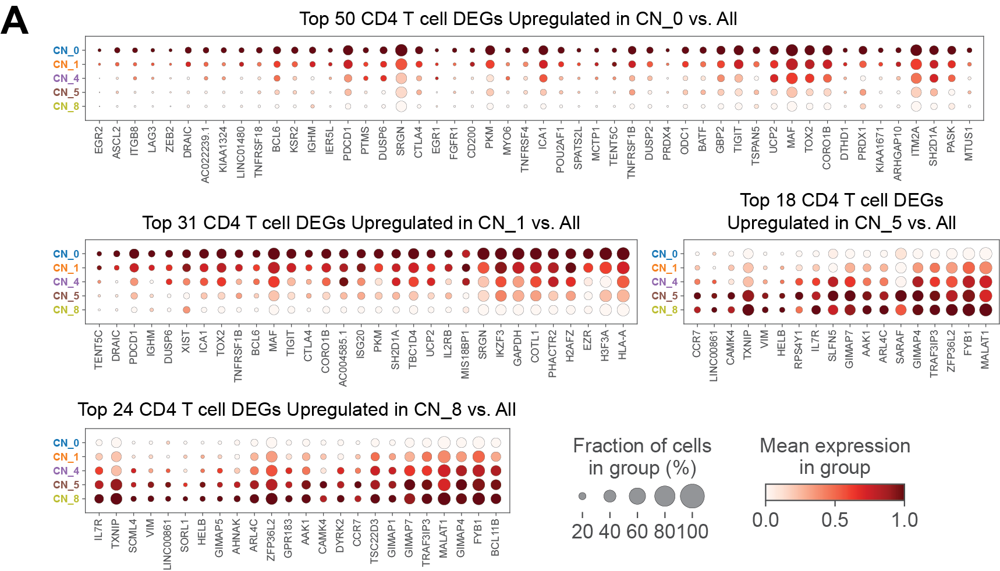

# ARCADIA - ARchetype-based Clustering and Alignment with Dual Integrative Autoencoders

> **Note**: This repository is currently under active development. Some components may be incomplete or subject to change. We recommend checking back periodically for updates.

This repository implements a novel method for understanding and aligning scRNA-seq and protein-based single-cell modalities (from CODEX spatial proteomics) by jointly embedding them using archetype analysis and dual variational autoencoders (VAEs). The approach captures and preserves cell neighborhood structures and archetype representations to reveal how local cell neighborhoods affect variability and relationships between transcriptomic and proteomic data.

paper preprint: [https://www.biorxiv.org/content/10.1101/2025.11.20.689521v1](https://www.biorxiv.org/content/10.1101/2025.11.20.689521v1)



## Contents

- [ARCADIA - ARchetype-based Clustering and Alignment with Dual Integrative Autoencoders](#arcadia---archetype-based-clustering-and-alignment-with-dual-integrative-autoencoders)
  - [Contents](#contents)
  - [Quick Start](#quick-start)
  - [System Requirements](#system-requirements)
  - [Installation](#installation)
  - [Pipeline Overview](#pipeline-overview)
  - [Detailed Workflow](#detailed-workflow)
    - [Step 0: Data Preprocessing](#step-0-data-preprocessing)
    - [Step 1: Dataset Alignment](#step-1-dataset-alignment)
    - [Step 2: Spatial Integration](#step-2-spatial-integration)
    - [Step 3: Archetype Generation](#step-3-archetype-generation)
    - [Step 4: Training Data Preparation](#step-4-training-data-preparation)
    - [Step 5: Model Training](#step-5-model-training)
  - [DualVAETrainingPlan Architecture](#dualvaetrainingplan-architecture)
    - [Core Components](#core-components)
    - [Key Methods](#key-methods)
  - [Running on ARCADIA](#running-on-arcadia)
  - [Results and Method Comparison](#results-and-method-comparison)
    - [Tonsil Dataset Integration Results](#tonsil-dataset-integration-results)
    - [Method Comparison](#method-comparison)
    - [Cell Neighborhood-Specific Analysis](#cell-neighborhood-specific-analysis)
      - [B Cell and Ki67+ Cell DEGs](#b-cell-and-ki67-cell-degs)
      - [CD4+ T Cell DEGs](#cd4-t-cell-degs)
      - [CD8+ T Cell DEGs](#cd8-t-cell-degs)
  - [Key Parameters](#key-parameters)
  - [How to cite ARCADIA](#how-to-cite-arcadia)
  - [BibTex](#bibtex)

## Quick Start

### Using the Reproducibility Repository (Recommended)
> We recommend using our ARCADIA reproducibility repository for quick runs on the existing benchmark datasets: https://github.com/azizilab/arcadia_reproducibility

If you're using the reproducibility repository, use the wrapper scripts:

```bash
# From the reproducibility repository root
bash run_pipeline_direct.sh cite_seq      # Fast execution without plots
bash run_pipeline_notebooks.sh cite_seq   # With plots saved as notebooks
```

See the [reproducibility repository README](https://github.com/azizilab/arcadia_reproducibility) for details.

**System Requirements:** To reproduce the results, we recommend a system with at least 60GB RAM (120GB preferred) and an NVIDIA T4 GPU or better.

### Running ARCADIA Scripts Directly

**Option 1: Using the pipeline script (Recommended)**
```bash
# Activate the conda environment
conda activate scvi

# Run the complete pipeline with a single command
bash run_pipeline.sh <dataset_name>
```

**Option 2: Running steps individually**
To run individual pipeline steps directly (example for CITE-seq spleen lymph node data from [scvi-tools](https://scvi-tools.org/) using `scvi.data.spleen_lymph_cite_seq()`):

```bash
# Activate the conda environment
conda activate scvi

# Run the complete pipeline for <dataset_name>
python scripts/_0_preprocess_<dataset_name>.py
python scripts/_1_align_datasets.py --dataset_name <dataset_name>
python scripts/_2_spatial_integrate.py --dataset_name <dataset_name>
python scripts/_3_generate_archetypes.py --dataset_name <dataset_name>
python scripts/_4_prepare_training.py --dataset_name <dataset_name>
python scripts/_5_train_vae.py --dataset_name <dataset_name>
```

**Note:** 
- The `cite_seq` dataset is loaded from [scvi-tools](https://scvi-tools.org/) using `scvi.data.spleen_lymph_cite_seq()`. See `scripts/_0_preprocess_cite_seq.py` and `src/arcadia/data_utils/loading.py` for details.
- Only Step 0 (preprocessing) is dataset-specific and requires a different script for each dataset (e.g., `scripts/_0_preprocess_tonsil.py` for the tonsil dataset). Steps 1-5 are dataset-agnostic and automatically read the latest output files from Step 0, regardless of which dataset was preprocessed.

## System Requirements

- **Operating System:** Linux/Unix (tested on Ubuntu)
- **Python Version:** Python 3.10
- **Docker:** Docker (optional but recommended for reproducibility and easier setup)
- **GPU:** NVIDIA GPU with CUDA support (recommended for VAE training)
- **Memory:** Minimum 32GB RAM recommended
- **Storage:** At least 50GB free space for data and checkpoints

## Installation

1. **Clone the repository:**
   ```bash
   git clone https://github.com/azizilab/ARCADIA_public.git
   cd ARCADIA
   ```

2. **Set up your Python Environment (Choose ONE option):**

   **Option A: Using Docker (Recommended)**

   Docker provides a containerized environment that ensures consistent execution across different systems. This is the easiest and most reliable way to run ARCADIA.

   **Quick Start:**

   ```bash
   cd environments/docker
   bash run_docker.sh test                    # Build and test
   bash run_docker.sh pipeline <dataset_name> # Run pipeline (e.g., cite_seq, tonsil)
   bash run_docker.sh bash                     # Interactive session
   ```

   **Prerequisites:** Docker installed (NVIDIA Docker runtime optional for GPU support)

   **Note:** The Docker image automatically patches the scVI library (`scvi-tools==1.2.2.post2`) to support custom training plans. This patch adds `self._training_plan = training_plan` at line 131 in `scvi/model/base/_training_mixin.py`, which is required for ARCADIA's dual VAE training. The patching happens automatically during Docker image build using `arcadia.utils.setup_scvi_patch`, so no manual intervention is needed.

   > **📖 For detailed Docker documentation** including setup instructions, usage examples, troubleshooting, and advanced usage, see [`environments/docker/DOCKER_README.md`](environments/docker/DOCKER_README.md).

   ---

   **Alternative Option (Conda):**

   If you prefer to manage your own Python environment, you can use conda environment files. Note that this requires manual setup and may be less reproducible across different systems.

   **Option B: Using Conda Environment Files**

   We provide environment files tailored for different setups. These will create a conda environment named appropriately (e.g., `scvi-cpu`, `scvi-gpu-cuda11.8`).

   *   **For NVIDIA GPU (CUDA 11.8 or 12.1):**
       Make sure your NVIDIA drivers are compatible with your desired CUDA version.
       ```bash
       # For CUDA 11.8:
       conda env create -f environments/environment_gpu_cuda11.8.yaml
       conda activate scvi-gpu-cuda11.8

       # For CUDA 12.1:
       conda env create -f environments/environment_gpu_cuda12.1.yaml
       conda activate scvi-gpu-cuda12.1
       ```

   *   **Patch scVI library for custom training plans:**
       ```bash
       # Install ARCADIA package first (if not already installed)
       pip install -e .
       # Then patch scVI (required for ARCADIA's dual VAE training)
       python -m arcadia.utils.setup_scvi_patch
       ```
       **Why is patching needed?** ARCADIA uses a custom `DualVAETrainingPlan` class that requires access to `self._training_plan`. The patch adds this assignment at line 131 in `scvi/model/base/_training_mixin.py` after the `training_plan` is created.

## Pipeline Overview

The ARCADIA pipeline consists of six main steps:

1. **Data Preprocessing (Step 0)** - Clean and normalize CODEX protein and RNA-seq data
2. **Dataset Alignment (Step 1)** - Balance cell types and apply batch correction
3. **Spatial Integration (Step 2)** - Add spatial neighborhood features and reduce dimensionality
4. **Archetype Generation (Step 3)** - Identify cell archetypes using PCHA and align between modalities
5. **Training Data Preparation (Step 4)** - Format data for dual VAE training
6. **Model Training (Step 5)** - Train dual VAEs with custom loss functions for modality alignment

## Detailed Workflow
**Configuration:**
The script uses `configs/config.json` for parameters:
```json
{
  "subsample": {
    "num_rna_cells": 9999999999,
    "num_protein_cells": 9999999999
  },
  "plot_flag": true,
  "residualize_spatial_features": true,
  "training": {
    "max_epochs": 200
  }
}
```

This configuration file controls:
- **Subsampling**: Limits the number of RNA or protein cells processed (set to 9999999999 to include all cells in the dataset)
- **Plotting**: Controls whether plots are generated during preprocessing steps (`plot_flag`)
- **Spatial Features**: `residualize_spatial_features` controls spatial feature handling
- **Training**: Controls training hyperparameters, including `max_epochs` (number of training epochs)


The config file is used in each of the following pipeline files and is useful for debugging and exploration. **For debugging and testing, set `max_epochs` to a low number (e.g., 10-50) to quickly verify the pipeline works correctly.**

**💡 Tip for Fast Debugging Runs:**

For faster execution during development or testing:

1. **Reduce cell counts and training epochs** in `configs/config.json`:
```json
{
  "subsample": {
    "num_rna_cells": 500,
    "num_protein_cells": 500
  },
  "plot_flag": false,
  "training": {
    "max_epochs": 10
  }
}
```

2. **Disable training plots** by setting `plot_x_times: 0` in the training parameters (see `scripts/_5_train_vae.py`). This disables all training visualizations including first batch plots, latent space plots, and counterfactual plots.


### Step 0: Data Preprocessing
**Script:** `scripts/_0_preprocess_cite_seq.py` or `scripts/_0_preprocess_tonsil.py`

This step preprocesses raw CODEX spatial proteomics and RNA-seq data:

**Key Operations:**
- Load raw data files (dataset-specific)
- Quality control and outlier removal using MAD (Median Absolute Deviation)
- Normalize protein data using z-normalization (with optional log1p transformation)
- Select highly variable genes for RNA data (using knee detection)
- Perform spatial analysis on protein data
- Save processed data with timestamps

**Outputs:**
- `[dataset_name]/preprocessed_adata_rna_[timestamp].h5ad`
- `[dataset_name]/preprocessed_adata_prot_[timestamp].h5ad`

### Step 1: Dataset Alignment
**Script:** `scripts/_1_align_datasets.py`

This step aligns and harmonizes RNA and protein datasets:

**Key Operations:**
- Load preprocessed data from Step 0
- Balance cell type proportions between modalities (matching smaller dataset proportions)
- Select highly variable genes on raw counts
- Normalize protein data
- Compute PCA and UMAP embeddings for visualization
- Prepare data for spatial integration
- Save aligned data with timestamps

**Outputs:**
- `[dataset_name]/adata_rna_aligned_[timestamp].h5ad`
- `[dataset_name]/adata_prot_aligned_[timestamp].h5ad`

### Step 2: Spatial Integration
**Script:** `scripts/_2_spatial_integrate.py`

This step integrates spatial information and creates neighborhood-aware features:

**Key Operations:**

1. **Load Preprocessed Data:**
   - Automatically finds the latest preprocessed files from Step 1

2. **Spatial Neighborhood Analysis (for CODEX data):**
   - Compute spatial neighbors using adaptive k-NN (k=20 for >5000 cells, k=10 otherwise)
   - Filter distant neighbors using 95th percentile threshold
   - Protect 5 closest neighbors per cell to maintain connectivity
   - Calculate neighbor mean expressions as contextual features

3. **COVET Feature Engineering (optional):**
   - COVET (Covariate-assisted Embedding Transformation) can be applied with configurable k and g parameters
   - By default, neighbor means are used instead of COVET features
   - Combines original protein features with spatial context features
   - Row-wise z-score normalization for VAE input

4. **Protein VAE for Dimensionality Reduction (if needed):**
   - Train a simple VAE on combined protein+COVET features
   - Reduce to latent dimension specified in hyperparameters
   - Replace protein data with VAE latent space representation
   - Original features preserved in `obsm['protein+neighbors_means+covet']`

5. **Add Cell Neighborhood (CN) Labels:**
   - Generate CN labels using empirical clustering (KMeans or Leiden) on non-protein spatial features
   - For cite_seq dataset: Uses KMeans with 4 clusters (fixed because synthetic spatial data is constructed to have 4 CN)
   - For other datasets: Uses elbow/knee method to automatically determine optimal number of clusters (k between 5-20)
   - CN labels assigned as categorical variables (CN_0, CN_1, etc.)
   - Prepare data for archetype generation

**Outputs:**
- `[dataset_name]/adata_rna_spatial_integrated_[timestamp].h5ad`
- `[dataset_name]/adata_prot_spatial_integrated_[timestamp].h5ad`

### Step 3: Archetype Generation
**Script:** `scripts/_3_generate_archetypes.py`

This step identifies cell archetypes and aligns them across modalities:

**Key Operations:**

1. **Archetype Detection using PCHA:**
   - Apply Principal Convex Hull Analysis on PCA representations
   - Test range of archetype numbers (default: 7-13)
   - Use batch-aware archetype generation for consistent representation across batches
   - Select optimal k that works across all modalities and batches

2. **Cross-Modal Archetype Alignment:**
   - For each archetype, identify cells most aligned to it (highest archetype loading)
   - Compute cell type proportion vectors for each archetype based on these aligned cells
   - Match RNA and protein archetypes by comparing their cell type proportion vectors using cosine distance
   - Optimize matching to find the best correspondence between modalities
   - Validate alignment with extreme archetype analysis


**Outputs:**
- `[dataset_name]/adata_rna_archetype_generated_[timestamp].h5ad`
- `[dataset_name]/adata_prot_archetype_generated_[timestamp].h5ad`
- Both files contain:
  - `obsm['archetype_vec']`: Cell loadings on archetypes
  - `obs['archetype_label']`: Dominant archetype assignment
  - `uns['archetypes']`: Archetype coordinates in PCA space

### Step 4: Training Data Preparation
**Script:** `scripts/_4_prepare_training.py`

This step prepares the archetype-annotated data for VAE training:

**Key Operations:**

1. **Data Loading and Subsampling:**
   - Load latest archetype-generated files
   - Subsample to specified number of cells (from config.json)
   - Order cells by major and minor cell types for batch construction

2. **Cross-Modal Cell Matching:**
   - Find closest protein cell for each RNA cell using cosine distance on archetype vectors
   - Assign cell neighborhoods (CN) from protein to RNA data
   - Calculate initial matching distances for baseline metrics
   - Process in batches for memory efficiency

3. **Compute Embeddings:**
   - Generate PCA and UMAP for visualization
   - Store original embeddings for comparison

4. **Data Conversion:**
   - Convert data to integer representation based on detected gene likelihood (ZINB, NB, or Normal)
   - Normalize library sizes for both modalities
   - Set up scVI-compatible batch and library size columns

5. **Quality Checks:**
   - Visualize cell type distributions
   - Plot archetype heatmaps
   - Analyze B cell subtypes and spatial patterns



**Outputs:**
- `[dataset_name]/adata_rna_subset_prepared_for_training_[timestamp].h5ad`
- `[dataset_name]/adata_prot_subset_prepared_for_training_[timestamp].h5ad`
- Metadata tracking preprocessing steps and matching quality

### Step 5: Model Training
**Script:** `scripts/_5_train_vae.py` OR `scripts/hyperparameter_search.py`

Train the dual VAE model using the custom training plan:

**Option A: Single Training Run**
Use `scripts/_5_train_vae.py` with predefined hyperparameters. Note: The hyperparameter search uses different defaults (see Option B).

Example parameters:
```python
training_params = {
    "max_epochs": 500,
    "batch_size": 1024,
    "lr": 1e-3,
    "latent_dim": 60,
    "n_hidden_rna": 1024,
    "n_hidden_prot": 512,
    "n_layers": 3,
    "matching_weight": 1.0,
    "cell_type_clustering_weight": 1.0,
    "cross_modal_cell_type_weight": 1.0,
    "cn_distribution_separation_weight": 0.0,
    "similarity_weight": 0.0,  # Can be enabled for integration
    "dropout_rate": 0.1,
    "plot_x_times": 5,  # Number of times to plot during training (set to 0 to disable all plots)
    "plot_first_step": True  # Only applies when plot_x_times > 0
}
```

**Controlling Training Visualizations:**

- `plot_x_times`: Controls how many times plots are generated during training. Set to `0` to disable **all** training plots (first batch plots, latent space visualizations, counterfactual plots, etc.) for faster execution.
- `plot_first_step`: When `plot_x_times > 0`, enables plotting at the first training step. Has no effect when `plot_x_times=0`.

**Option B: Hyperparameter Search (recommended)**

Use `scripts/hyperparameter_search.py` to explore parameter space:
- Automatically tracks experiments with MLflow
- Skips previously tested parameter combinations
- Provides time estimates for completion
- Saves checkpoints and logs for each run

**Key Training Features:**
- Custom loss functions for modality alignment
- Adaptive similarity weight based on iLISI score
- Checkpointing every N epochs
- Comprehensive logging and visualization
- Early stopping capabilities

**Outputs:**
- Model checkpoints saved in `checkpoints/[dataset_name]/` directory
- Training metrics and visualizations logged to MLflow (accessible via `mlflow ui`)
- Trained model files and latent representations
- Training logs and experiment tracking data



## DualVAETrainingPlan Architecture

The `dual_vae_training_plan.py` (located in `src/arcadia/training/`) implements a sophisticated training strategy for jointly training two VAEs:

### Core Components

1. **Dual Model Management:**
   - Manages separate VAE models for RNA and protein data
   - Coordinates parameter updates across both models
   - Implements different learning rates for each modality

2. **Custom Loss Functions:**

   **a) Reconstruction Losses:**
   - Standard VAE reconstruction loss for each modality
   - KL divergence regularization with modality-specific weights

   **b) Similarity Loss:**
   - Enforces similar distance distributions within and across modalities
   - Adaptive weight based on integration quality (iLISI score)
   - Automatic activation/deactivation based on steady-state detection

   **c) Matching Loss:**
   - Aligns cells with similar archetype profiles across modalities
   - Uses extreme archetype matching for robust alignment
   - Based on KL divergence in latent space

   **d) Cell Type Clustering Loss:**
   - Within-modality: ensures cell types cluster in latent space
   - Cross-modal: aligns same cell types across modalities
   - Includes balance term to prevent modality collapse

   **e) CN Distribution Separation Loss:**
   - Separates different cell neighborhoods within each cell type
   - Uses kernel-based distribution matching
   - Prevents neighborhood information loss

3. **Training Strategy:**


   **Steady-State Detection:**
   - Monitors similarity loss variance over sliding window
   - Deactivates similarity loss when converged
   - Reactivates if loss increases significantly

4. **Validation and Metrics:**
   - Computes matching accuracy between modalities
   - Calculates silhouette F1 and ARI scores
   - Tracks iLISI for integration quality
   - Generates UMAP visualizations during training

5. **Checkpointing System:**
   - Saves model states, optimizers, and training history
   - Stores latent representations in AnnData objects
   - Includes counterfactual predictions (RNA→Protein, Protein→RNA)
   - Integrates with MLflow for experiment tracking

### Key Methods

- `calculate_losses()`: Computes all loss components for a batch
- `update_similarity_weight()`: Adaptively adjusts integration strength
- `on_validation_epoch_end()`: Calculates comprehensive metrics
- `save_checkpoints()`: Persists model state with metadata
- `load_from_checkpoints()`: Restores training from saved state

## Repository Structure

```
ARCADIA/
├── scripts/                                   # Pipeline scripts
│   ├── _0_preprocess_cite_seq.py             # CITE-seq preprocessing
│   ├── _0_preprocess_tonsil.py                # Tonsil preprocessing
│   ├── _1_align_datasets.py                   # Dataset alignment
│   ├── _2_spatial_integrate.py                # Spatial integration
│   ├── _3_generate_archetypes.py             # Archetype generation
│   ├── _4_prepare_training.py                # Training preparation
│   ├── _5_train_vae.py                       # Model training
│   └── hyperparameter_search.py              # Hyperparameter optimization
├── raw_datasets/                              # Raw data files only
│   ├── cite_seq/                              # Data files for cite_seq dataset
│   └──tonsil/                                # Data files for tonsil dataset
├── src/arcadia/                               # Package code
│   ├── core/                                  # Core models
│   ├── training/                              # Training utilities
│   ├── data_utils/                            # Data loading/preprocessing
│   ├── spatial/                               # Spatial analysis
│   ├── archetypes/                            # Archetype analysis
│   └── plotting/                              # Visualization
├── configs/                                   # Configuration files
│   └── config.json                            # Main config

```

## Reproducing Results

To reproduce the paper results:

1. **Setup Environment:**
   Follow the installation instructions above (Docker recommended, or use conda environment files from `environments/` folder)

2. **Run Complete Pipeline:**

   **Option A: Using the pipeline script (Recommended)**
   ```bash
   # Run the complete pipeline with a single command
   bash run_pipeline.sh <dataset_name>
   ```

   **Option B: Running steps manually**
   ```bash
   # Run pipeline steps individually
   python scripts/_0_preprocess_<dataset_name>.py
   python scripts/_1_align_datasets.py --dataset_name <dataset_name>
   python scripts/_2_spatial_integrate.py --dataset_name <dataset_name>
   python scripts/_3_generate_archetypes.py --dataset_name <dataset_name>
   python scripts/_4_prepare_training.py --dataset_name <dataset_name>
   python scripts/_5_train_vae.py --dataset_name <dataset_name>
   ```

3. **View Results:**
   - Model checkpoints in `checkpoints/`
   - MLflow tracking UI: `mlflow ui`

### Viewing Training Results with MLflow

During VAE training (when running `scripts/_5_train_vae.py`), all training metrics, loss curves, and visualizations are automatically logged to MLflow. You can view these results in an interactive web interface. (Note: All other plots from other pipeline scripts are not saved but can be viewed as those files run.)

**Starting MLflow UI:**

```bash
# From the ARCADIA directory (where mlruns folder is located)
cd ARCADIA

# Start MLflow UI server
mlflow ui

```

For more information, see the [MLflow documentation](https://mlflow.org/docs/latest/index.html).

**Accessing MLflow in Browser:**

Once MLflow UI is running, open your web browser and navigate to:
- **Local machine:** `http://localhost:5000`
- **Remote server:** `http://<server-ip>:5000` (or your specified port)
- **SSH tunnel (for remote access):**
  ```bash
  # On your local machine, create an SSH tunnel:
  ssh -L 5000:localhost:5000 user@remote-server
  # Then access http://localhost:5000 in your local browser
  ```

**Note:** Navigate to the experiment named after your dataset (e.g., `cite_seq` or `tonsil`) to view the training results. Both `scripts/hyperparameter_search.py` and `scripts/_5_train_vae.py` organize experiments by dataset name, making it easy to compare runs across different datasets.

**What You Can View:**

- **Training Metrics:** Loss curves (reconstruction, similarity, matching, cell type clustering, etc.) tracked over epochs
- **Training Plots:**
  - Combined latent space PCA/UMAP visualizations showing modality integration
  - CN-specific cell type UMAPs for each cell neighborhood
  - Modality-specific visualizations (RNA vs Protein)
- **Model Parameters:** All hyperparameters used for each training run
- **Artifacts:** Saved model checkpoints, training logs, and visualization PDFs organized by experiment and run
- **Experiment Comparison:** Compare multiple training runs side-by-side to evaluate different hyperparameter configurations

**Tips:**

- Training plots are only generated when `plot_x_times > 0` in your training parameters (see `scripts/_5_train_vae.py`). Set `plot_x_times: 0` to disable **all** plotting during training (including first batch plots, latent space visualizations, counterfactual plots, etc.) for faster execution. When `plot_x_times=0`, no plots will be generated regardless of the `plot_first_step` setting.
- Artifacts are stored in the `mlruns/` directory and can be downloaded directly from the UI

## Results and Method Comparison

### Tonsil Dataset Integration Results


### Method Comparison

ARCADIA compared against MaxFuse and scMODAL:


### Cell Neighborhood-Specific Analysis

Differential gene expression analysis reveals cell neighborhood-specific patterns:



#### B Cell and Ki67+ Cell DEGs



#### CD4+ T Cell DEGs



#### CD8+ T Cell DEGs


## Key Parameters

Important parameters that affect results:

- **Archetype Detection:**
  - `k`: Number of archetypes (7-13 tested, optimal selected automatically)
  - `covet_k`: COVET neighborhood size (configurable, default 10)
  - `covet_g`: COVET grid size (64)
  - Note: By default, neighbor means are used instead of COVET features

- **VAE Architecture:**
  - `latent_dim`: Latent dimension (10-60 tested, 60 used in hyperparameter search)
  - `n_hidden_rna`: RNA encoder width (1024 recommended based on F1 score)
  - `n_hidden_prot`: Protein encoder width (512 recommended based on kBET score)
  - `n_layers`: Number of layers (3 recommended, 5 layers learn too slowly)

- **Training Dynamics:**
  - `similarity_weight`: Integration strength (10-100000)
  - `ilisi_threshold`: Target integration score (1.5)
  - `cn_distribution_separation_weight`: Neighborhood preservation (10-50)

## How to cite ARCADIA

```
Rozenman, B., Hoffer-Hawlik, K., Djedjos, N., Azizi, E.
ARCADIA reveals spatially dependent transcriptional programs through integration of scRNA-seq and spatial proteomics.
bioRxiv (2025).
[https://doi.org/10.1101/2025.11.20.689521](https://doi.org/10.1101/2025.11.20.689521)

```

## BibTex
```
@article {Rozenman2025.11.20.689521,
	author = {Rozenman, Bar and Hoffer-Hawlik, Kevin and Djedjos, Nicholas and Azizi, Elham},
	title = {ARCADIA Reveals Spatially Dependent Transcriptional Programs through Integration of scRNA-seq and Spatial Proteomics},
	elocation-id = {2025.11.20.689521},
	year = {2025},
	doi = {10.1101/2025.11.20.689521},
	publisher = {Cold Spring Harbor Laboratory},
	URL = {https://www.biorxiv.org/content/early/2025/11/21/2025.11.20.689521},
	eprint = {https://www.biorxiv.org/content/early/2025/11/21/2025.11.20.689521.full.pdf},
	journal = {bioRxiv}
}
```

If you have questions, please contact the authors:

- Bar Rozenman - br2783@columbia.edu
- Kevin Hoffer-Hawlik - kh3205@columbia.edu
- Elham Azizi - elham@azizilab.com
